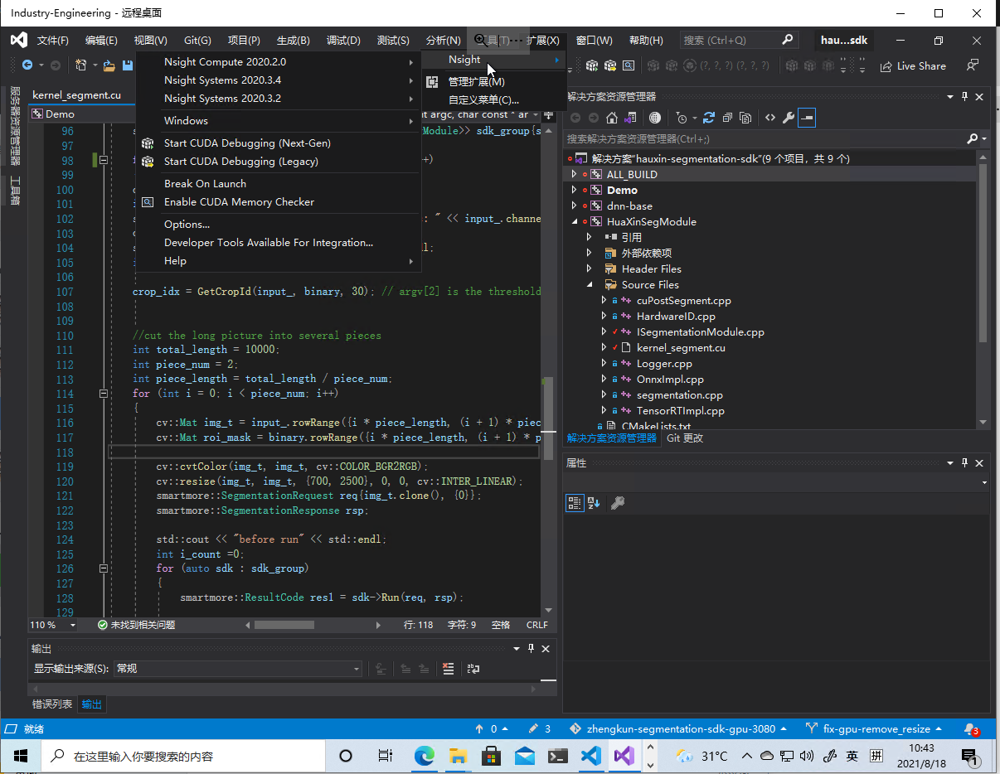

# 背景
windows下CUDA开发一般都是选择Visual Studio进行开发，需要先安装Visual Studio（一定要先安装），然后安装CUDA（CUDA会自动集成到Visual Studio中），之后就可以直接在Visual Studio中新建CUDA项目进行开发。
vs code 无法在windows下面进行debug,并且也需要实现安装好visual studio。本文主要介绍windows 下使用visual studio 开发配置流程。

# 安装 vs 和 cuda
先安装visual studio （2017或者2019）, 然后安装cuda。可以去NVIDIA官网下载CUDA11.1的安装包，下载完成后点击安装，一般默认不修改，一路点击OK，安装CUDA程序；

# 安装 nsight 插件
cuda自带的nsight插件在更新版本后没有了performance analysis 功能，需要在

[NVIDIA官网]: https://developer.nvidia.com/nsight-visual-studio-code-edition

下载最新的nsight插件。 下载安装后如图所示：

# 使用nsight
最新版的nsight trace 使用 profile 替代了performance analysis 和 NVIDIA visual profiler, 运行时需要管理员权限。

选择工具->Nsight->Nsight systems 2020.3.2-> trace, 运行程序即可开始Profile过程。

