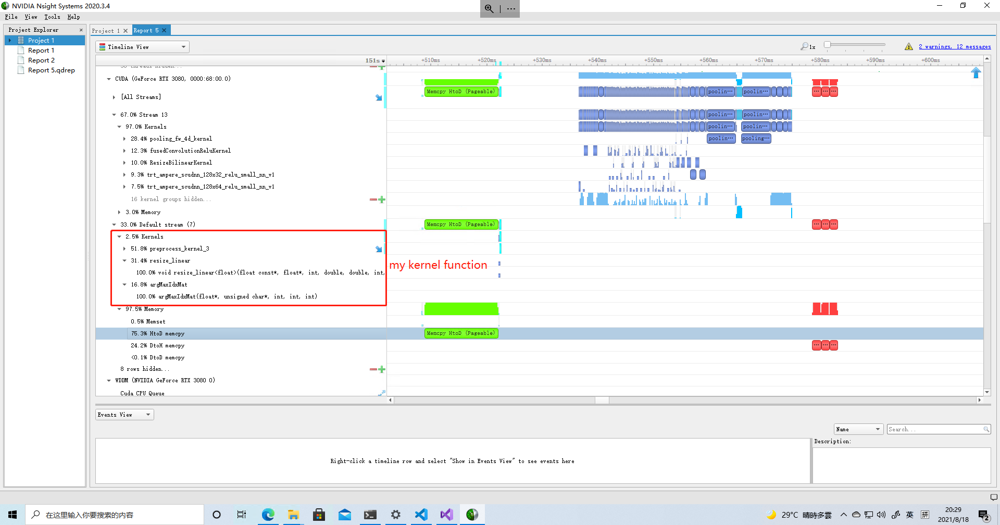

# Background and introduction

使用 *Assess, Parallelize, Optimize, Deploy (APOD)* design cycle 可以快速找到应用中可以从gpu获得最大收益的部分。本文以华星光电项目为例，记录了一个简单的加速过程。https://docs.nvidia.com/cuda/cuda-c-best-practices-guide/index.html

# assess: 优化前sdk性能
这一步评估程序的加速潜力，使用weak_scaling 来估计出理论上最高的加速比。当每个处理器的工作量基本固定，评估计算时间如何随着处理器数量变化。

三个hotspot:

-  模型初始化加速 （40% 时间）
-  将前处理的resize函数使用gpu并行
-  去除多余的 cudaDeviceSynchronize 调用

# parallelize and optimize (cuda并行方案)
当完成后两项后，加速效果并不理想，如下图所示：

此处可以发现几个问题

1. 模型初始化和推理的时间较长
2. 大量的时间（14ms）花费在了拷贝内容到显存上和从显存拷贝内容。 

# Deploy: 优化后sdk性能

# 备注：

##  Strong scaling and Amdahl's Law

Strong scaling is a measure of how, for a fixed overall problem size, the time to solutiondecreases as more processors are added to a system. An application that exhibits linearstrong scaling has a speedup equal to the number of processors used.
$$
S = \frac{1}{(1+P)+ \frac{P}{N}}
$$
Here P is the fraction of the total serial execution time taken by the portion of code that can be parallelized and N is the number of processors over which the parallel portion of
the code runs.

## Weak Scaling and Gustafson's Law

Weak scaling is a measure of how the time to solution changes as more processors are added to a system with a fixed problem size per processor.
$$
S = N + (1-P)(1-N) = (1-P) + PN
$$
Here P is the fraction of the total serial execution time taken by the portion of code that can be parallelized and N is the number of processors over which the parallel portion of the code runs
